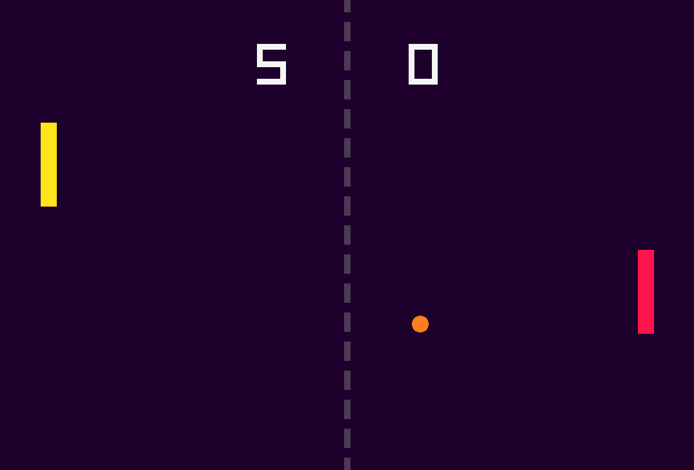

Pong - Raylib

A simple Pong game made with C++ and Raylib.

Features:

Play against the computer
Local multiplayer on the same computer
Keyboard or mouse controls
Scoreboard
First player to reach 10 points wins
Ball gradually increases in speed as the round progresses
Ball speed resets when a new round starts

Controls:

Player 1

↑ — Move up

↓ — Move down

Player 2

W — Move up

S — Move down

Built With:

C++
Raylib
raygui

